# AI Code Debugger & Auto-Fixer - Technical Documentation

## Executive Summary

The AI Code Debugger & Auto-Fixer is an advanced software analysis tool that leverages Google's Gemini AI to automatically review, debug, and fix code across multiple programming languages. This comprehensive documentation provides a detailed overview of the tool's capabilities, technical architecture, working methodology, and current limitations for professional evaluation.

---

## Table of Contents

1. [Project Overview](#1-project-overview)
2. [Technical Stack](#2-technical-stack)
3. [Core Features & Capabilities](#3-core-features--capabilities)
4. [Architecture & Working Algorithm](#4-architecture--working-algorithm)
5. [Current Limitations & Known Issues](#5-current-limitations--known-issues)
6. [Installation & Setup Requirements](#6-installation--setup-requirements)
7. [Usage Guidelines](#7-usage-guidelines)
8. [Testing Recommendations](#8-testing-recommendations)
9. [Future Enhancement Roadmap](#9-future-enhancement-roadmap)

---

## 1. Project Overview

### 1.1 Purpose
The AI Code Debugger automates the process of code review, bug detection, and code correction across entire software projects. It serves as an AI-powered assistant for developers, reducing manual code review time and identifying potential issues that might be missed during human review.

### 1.2 Key Value Propositions
- **Multi-language Support**: Analyzes 8+ programming languages simultaneously
- **Batch Processing**: Handles large codebases through intelligent chunking
- **Interactive Fixing**: Provides controlled, user-approved code modifications
- **Comprehensive Reporting**: Generates detailed review documentation
- **Security Focus**: Identifies security vulnerabilities and best practice violations

---

## 2. Technical Stack

### 2.1 Core Technologies
| Component | Technology | Version/Purpose |
|-----------|------------|-----------------|
| **AI Engine** | Google Gemini API | gemini-2.0-flash model |
| **Frontend** | Tkinter (Python) | Cross-platform GUI |
| **Backend** | Python 3.7+ | Core application logic |
| **Data Export** | OpenPyXL | Excel report generation |
| **UI Enhancement** | Rich Library | Console formatting |

### 2.2 Supported Languages & File Types
```python
SUPPORTED_SUFFIXES = (".py", ".js", ".jsx", ".ts", ".java", ".cpp", ".html", ".css")
```

### 2.3 Dependencies
- `google-generativeai` - Gemini AI integration
- `openpyxl` - Excel file generation
- `rich` - Enhanced console output
- `tkinter` - Graphical user interface (built-in)

---

## 3. Core Features & Capabilities

### 3.1 ✅ Working Features

#### 3.1.1 Multi-File Code Analysis
- **Recursive Directory Scanning**: Automatically discovers code files in nested directories
- **Intelligent File Filtering**: Skips common directories (node_modules, .git, __pycache__)
- **Batch Processing**: Handles large projects through configurable chunk sizes

#### 3.1.2 Comprehensive Code Review
- **Syntax & Runtime Error Detection**: Identifies undefined variables, import errors, type issues
- **Logic & Edge Case Analysis**: Detects off-by-one errors, null checks, boundary conditions
- **Security Vulnerability Scanning**: 
  - Hardcoded secrets detection
  - XSS/CSRF risks identification
  - Command injection vulnerabilities
  - Insecure API implementations
- **Exception Handling Analysis**: Evaluates try/except coverage, overbroad except clauses, and swallowed errors
- **Resource Management**: Identifies file/network resource leaks and missing context managers
- **Dependency & Import Validation**: Detects circular imports, missing modules, and path mismatches
- **API Contract Compliance**: Validates parameter types, return types, and async/await usage
- **Concurrency & State Management**: Identifies shared state mutation and async/threading pitfalls
- **Frontend Integration**: Checks HTML/CSS/JS linkage, DOM selectors, and asset loading
- **Performance Optimization**: Detects N+1 queries, excessive loops, and heavy synchronous I/O
- **Code Quality Metrics**: Assesses duplication, function length, naming conventions, and documentation

#### 3.1.3 Automated Code Fixing
- **Interactive Fix Application**: User-controlled code modifications
- **Safe Backup System**: Automatic .bak file creation before modifications
- **Code Fence Cleaning**: Proper Markdown-to-code conversion
- **Batch-wise Processing**: Applies fixes immediately after each review batch

#### 3.1.4 Reporting & Documentation
- **Multi-format Export**: Excel and JSON output support
- **Structured Review Tables**:
  - Code Quality Checklist
  - API Call Summary
  - Security Issues Catalog
- **Raw Review Preservation**: Complete AI output storage

#### 3.1.5 Dual Interface Support
- **Graphical User Interface**: Tkinter-based desktop application
- **Command Line Interface**: Scriptable batch processing
- **Real-time Progress Tracking**: Live status updates and progress bars

### 3.2 🔄 Partially Working Features

#### 3.2.1 AI Response Parsing
- **Status**: Functional but fragile
- **Current Implementation**: Basic Markdown code fence removal
- **Limitation**: May struggle with complex AI response formats

#### 3.2.2 Error Recovery
- **Status**: Basic implementation
- **Current Capability**: Continues processing after individual file errors
- **Limitation**: No retry mechanism for API failures

### 3.3 ❌ Non-Functional/Unimplemented Features

#### 3.3.1 Advanced AI Features
- **Context Persistence**: No memory of previous analysis sessions
- **Multi-model Support**: Fixed to Gemini 2.0 Flash only
- **Confidence Scoring**: No probability estimates for suggested fixes

#### 3.3.2 Enterprise Features
- **Team Collaboration**: No user management or sharing capabilities
- **Version Control Integration**: No direct Git/SVN integration
- **CI/CD Pipeline Integration**: Cannot be embedded in automated workflows

#### 3.3.3 Advanced Analysis
- **Architecture Review**: No high-level design pattern analysis
- **Performance Profiling**: No runtime performance recommendations
- **Dependency Analysis**: No third-party library vulnerability scanning

---

## 4. Architecture & Working Algorithm

### 4.1 System Architecture Diagram

```
┌─────────────────┐    ┌──────────────────┐    ┌─────────────────┐
│   Input Layer   │    │  Processing      │    │  Output Layer   │
│                 │    │  Engine          │    │                 │
│  • CLI Args     │──▶│  • File Scanner  │───▶│  • Console      │
│  • GUI Input    │    │  • Batch Creator │    │  • Excel Report │
│  • Config       │    │  • AI Integrator │    │  • JSON Export  │
└─────────────────┘    │  • Fix Applier   │    └─────────────────┘
                       └──────────────────┘
                               │
                               ▼
                       ┌──────────────────┐
                       │  External AI     │
                       │  (Gemini API)    │
                       └──────────────────┘
```

### 4.2 Core Algorithm Flowchart

<div style="height: 1300px; margin-left : 20vw">
  
</div>

### 4.3 Detailed Algorithm Explanation

#### 4.3.1 File Discovery & Chunking Phase
```python
def chunk_files(files, file_contents, max_chars):
    """
    Algorithm: Greedy batching with size constraints
    Time Complexity: O(n)
    Space Complexity: O(n)
    """
    batches, batch_files = [], []
    current_batch, current_files, current_length = [], [], 0
    
    for file in files:
        section = build_file_section(file, file_contents[file])
        if current_batch and (current_length + len(section) > max_chars):
            # Commit current batch and start new one
            batches.append("\n".join(current_batch))
            batch_files.append(current_files)
            current_batch, current_files, current_length = [section], [file], len(section)
        else:
            # Add to current batch
            current_batch.append(section)
            current_files.append(file)
            current_length += len(section)
    
    # Handle final batch
    if current_batch:
        batches.append("\n".join(current_batch))
        batch_files.append(current_files)
    
    return batches, batch_files
```

#### 4.3.2 AI Analysis Phase
The system uses a sophisticated prompt engineering approach:

```python
def review_project(all_code: str, user_prompt: Optional[str]) -> str:
    prompt = f"""
You are an expert software debugger and code reviewer.

Analyze the entire project for defects and risks. Each section below starts with "### FILE PATH:"
and contains the full code for that file. Provide precise, actionable findings and corrected code.

Scope of checks (be thorough and conservative):
- Syntax errors and runtime errors (undefined names, indexing, attribute, import errors)
- Incorrect logic and edge cases (off-by-one, null/None checks, empty input handling)
- Exception handling quality (missing try/except where needed; overbroad excepts; swallowed errors)
- Resource handling (files, network, subprocesses) and leaks; context managers where applicable
- Dependency/import issues (wrong filenames/paths/extensions, missing modules, circular imports)
- API contract mismatches (wrong params/return types, missing awaits, async misuse)
- Type issues and nullability; mutation of shared state; concurrency/async pitfalls
- HTML/CSS/JS linkage mistakes (wrong script/style paths, case sensitivity, extension mismatches)
- Frontend errors (DOM selectors, event binding, missing assets, incorrect MIME/rel attributes)
- Security concerns (eval/exec, command injection, XSS/CSRF risks, hardcoded secrets, plaintext keys)
- Performance hotspots (N+1 queries/polls, excessive loops, unbounded recursion, heavy sync I/O on UI)
- Code quality (duplication, long functions, poor naming, missing docs/comments where non-obvious)
- During api fetching the code should be wrapped in try catch block.If not then the corrected code which you will give should contain that try catch block
Additionally, include three Markdown tables for every file:

Chart 1 - Review Checklist: for the present code and not about the corrected code. The charts should be made for the existing codes
| Review Aspect | Status |
|---|---|
| Variable naming | ✅ / ❌ |
| Hardcoded values/secrets | ✅ / ❌ |
| Code repetition | ✅ / ❌ |
| Modularity | ✅ / ❌ |
| Complexity (high/med/low) | high/med/low |
| Comments & docs | ✅ / ❌ |
| Exception handling present | ✅ / ❌ |
| Dependency/import correctness | ✅ / ❌ |
| Security concerns | ✅ / ❌ |

Chart 2 - API Calls Summary (if any found):
| API Endpoint | Request (sample) | Response (sample) |
|---|---|---|
| (list endpoints or 'None') | | |

Chart 3 - Security Issues / Best Practices:
| Category | Recommendation |
|---|---|
| (e.g. plaintext password storage) | (recommendation) |

User requirement: {user_prompt or 'N/A'}
Important: Fix file import/link mismatches robustly. Example: if the folder has script.js but HTML imports app.js,
change it to script.js; similarly styles.css vs style.css, respecting actual files present. NEVER invent new files
that do not exist—choose the most plausible correct existing path/filename.

Here is the project:
{all_code}

Output format (repeat for all files whether there exists error or not. If no error is present then say that no error and in fixed code place the original code as it is, and if there is error then tell the error and give the corrected code in fixed code):
File: <path>
Error: <short description>
Fixed code:
\`\`\`<language>
<corrected file code>
\`\`\`
"""
```

#### 4.3.3 Fix Application Phase
```python
def auto_fix_project(path: str, review_output: str, files_to_process: List[str], apply_all=False, interactive: bool = True, prompt_func=None, ui_logger=None):
    """
    Auto-fix files based on review output.
    
    Args:
        path: Project directory path
        review_output: Review output for the files being processed
        files_to_process: List of file paths to process (only these files will be fixed)
        apply_all: Whether to apply all fixes automatically
        interactive: Whether to prompt for each fix
        prompt_func: Function to call for user prompts
        ui_logger: Optional UI logger function
    """
    model = genai.GenerativeModel(MODEL_NAME)

    for file_path in files_to_process:
        code = read_file(file_path)
        if not code:
            continue

        fix_prompt = f"""
You are an AI assistant. Using the review below, fix only issues related to this file.

Review:
{review_output}

File: {file_path}
Current Code:
\`\`\`{Path(file_path).suffix[1:]}
{code}
\`\`\`

Output the corrected code for this file only.
"""
        try:
            resp = model.generate_content(fix_prompt)
            new_code = resp.text.strip()
            console.rule(f"[bold yellow]🧠 Suggested Fix for {file_path}[/bold yellow]")
            if ui_logger:
                ui_logger(f"\n===== Suggested Fix for {file_path} =====\n")
                ui_logger(new_code[:3000] + ("\n...[truncated]\n" if len(new_code) > 3000 else "\n"))
            else:
                console.print(Markdown(new_code[:3000]))

            if apply_all:
                write_file(file_path, new_code)
            else:
                if interactive:
                    if ui_logger : 
                        apply_change = bool(prompt_func(f"Apply suggested changes to {file_path}?"))
                        if apply_change:
                            write_file(file_path, new_code)
                        else:
                            if ui_logger:
                                ui_logger(f"Skipped: {file_path}\n")
                            else:
                                console.print(f"[yellow]⏩ Skipped: {file_path}[/yellow]")
                    else :
                            choice = input(f"Apply suggested changes to {file_path}? (y/n): ").strip().lower()
                            if choice == 'y':
                                write_file(file_path, new_code)
                            else:
                                console.print(f"[yellow]⏩ Skipped: {file_path}[/yellow]")
                
                else:
                    if ui_logger:
                        ui_logger(f"Skipped (non-interactive): {file_path}\n")
                    
                    else:
                        console.print(f"[yellow]⏩ Skipped (non-interactive): {file_path}[/yellow]")
        except Exception as e:
            console.print(f"[red]Error fixing {file_path}: {e}[/red]")

```

### 4.4 Data Flow Diagram

```
┌─────────────┐    ┌─────────────┐    ┌─────────────┐    ┌─────────────┐
│   Source    │    │  Batch      │    │   Gemini    │    │  Processed  │
│   Code      │───▶│  Processor  │───▶│    AI       │───▶│   Output    │
│   Files     │    │             │    │             │    │             │
└─────────────┘    └─────────────┘    └─────────────┘    └─────────────┘
                         │                                      │
                         ▼                                      ▼
                 ┌─────────────┐                        ┌─────────────┐
                 │  Temporary  │                        │  Final      │
                 │   Batch     │                        │  Reports    │
                 │   Storage   │                        │  (Excel/JSON)│
                 └─────────────┘                        └─────────────┘
```

---

## 5. Current Limitations & Known Issues

### 5.1 Technical Limitations

#### 5.1.1 AI Model Constraints
- **Fixed Context Window**: Limited to ~200K characters per batch
- **Single Model Dependency**: No fallback if Gemini API is unavailable
- **No Fine-tuning**: Cannot be customized for specific codebases
- **Response Consistency**: AI may provide inconsistent formatting

#### 5.1.2 Code Analysis Limitations
- **No Abstract Syntax Tree (AST) Parsing**: Relies entirely on AI understanding
- **Limited Cross-batch Understanding**: Batch processing may miss inter-batch files dependencies
- **No Build System Integration**: Cannot understand complex build configurations
- **Static Analysis Only**: No runtime behavior analysis

#### 5.1.3 Performance Limitations
- **Sequential Processing**: No parallel batch processing
- **Network Dependency**: Requires stable internet connection
- **No Caching**: Re-analyzes entire project on each run
- **Memory Intensive**: Large projects may consume significant RAM

### 5.2 Functional Gaps

#### 5.2.1 Code Understanding
- **No Architecture Analysis**: Cannot identify design pattern violations
- **Limited Framework Awareness**: Generic analysis without framework-specific rules
- **No Test Code Analysis**: Does not review test quality or coverage

#### 5.2.2 Fix Quality
- **No Validation**: Applied fixes are not tested or validated
- **Potential Regression Risk**: Fixes may introduce new bugs
- **No Code Style Preservation**: May alter formatting and style

### 5.3 Security Considerations

#### 5.3.1 Data Privacy
- **Code Sent to External API**: All source code is transmitted to Google's servers
- **No Local Processing Option**: Requires cloud AI service
- **API Key Exposure**: Hardcoded fallback API key in source

#### 5.3.2 Access Control
- **No Authentication**: Anyone with access can run the tool
- **No Audit Logging**: No record of who ran analysis or applied fixes
- **No Permission Checking**: May attempt to modify read-only files

---

## 6. Installation & Setup Requirements

### 6.1 Prerequisites
- **Python 3.7+** with pip package manager
- **Google Gemini API Key** (free tier available)
- **Internet Connection** for AI API access
- **200MB+ Free Disk Space** for temporary files

### 6.2 Installation Steps
```bash
# 1. Clone or download the script
git clone https://github.com/ashay-patil/Ai-Code-Debugger-And-Auto-Fixer.git
cd Ai-Code-Debugger-And-Auto-Fixer

# 2. Install dependencies (Recommended to Use Virtual Environment)
pip install google-generativeai rich openpyxl

# 3. Set environment variable
export GEMINI_API_KEY="your_actual_api_key_here"
# and use dotenv for accessing the Gemini_API_KEY in the code

# 4. Run the application in GUI Mode
# Autofix checkbox disabled -> Only generates the review of Codebase without updating the codebase
# Autofix checkbox enabled -> Generates the review of Codebase and takes users permission to update the code in the codebase
# Autofix checkbox enabled + Apply All checkbox enabled -> Generates the review of Codebase and updates the Code Automatically without users permission
# JSON checkbox enabled -> Generates brief summary of Debugging in a JSON file 
python app.py

# 5. Run the Application in CLI Mode
# 5.1 Review Mode (No Autofix)
python app.py ./project-path --json

# 5.2 Review + AutoFix Mode 
python app.py ./project-path --json --autofix

# 5.3 Review + AutoFix + Auto Code Updation Mode 
python app.py ./project-path --json --autofix --apply-all

# 5.4. Custom userpromt 
python app.py ./project-path --json --autofix --userprompt "Make the body color as purple in css file"


```

### 6.3 Configuration Options
| Environment Variable | Purpose | Default |
|---------------------|---------|---------|
| `GEMINI_API_KEY` | Google AI API authentication | Required |
| `GEMINI_MODEL_NAME` | AI model selection | `gemini-2.0-flash` |

---

## 7. Usage Guidelines

### 7.1 Recommended Use Cases

#### 7.1.1 ✅ Suitable Scenarios
- **Legacy Code Analysis**: Understanding unfamiliar codebases
- **Code Quality Assessment**: Pre-PR review automation
- **Security Scanning**: Basic vulnerability detection
- **Learning Tool**: Understanding code issues for junior developers
- **Documentation Generation**: Automated codebase documentation

#### 7.1.2 ❌ Unsuitable Scenarios
- **Production Deployment**: Should not be used as gatekeeper for deployments
- **Critical Security Code**: Financial, healthcare, or safety-critical systems
- **Performance-Critical Code**: Real-time or high-performance applications
- **Legal Compliance**: Regulated industries without human oversight

### 7.2 Best Practices

#### 7.2.1 Project Preparation
```bash
# 1. Start with small projects
python app.py ./small-project --autofix  # CLI Interactive mode

# 2. Use dry-run mode first
python app.py ./project --json # CLI Review Mode

```

#### 7.2.2 Risk Mitigation
- **Use Version Control**: Ensure all changes can be reverted
- **Backup Important Code**: Tool creates .bak files but additional backups recommended
- **Test Thoroughly**: Always test applied fixes in development environment
- **Review AI Suggestions**: Never apply fixes without understanding changes

---


## Conclusion

The AI Code Debugger & Auto-Fixer represents a significant step forward in automated code analysis, leveraging state-of-the-art AI technology to assist developers in maintaining code quality and security. While the tool demonstrates impressive capabilities in multi-language analysis and automated fixing, it should be viewed as an assistant rather than a replacement for human code review.

For evaluation, we recommend focusing on:
1. **Accuracy Assessment**: Measure false positive/negative rates in your specific codebases
2. **Integration Potential**: Evaluate fit with existing development workflows
3. **ROI Calculation**: Time savings vs. implementation and training costs
4. **Risk Assessment**: Security and reliability implications for your projects

The tool shows particular promise for educational use, legacy code modernization, and as a training aid for junior developers. With the planned enhancements, it has the potential to evolve into an enterprise-grade code quality platform.
